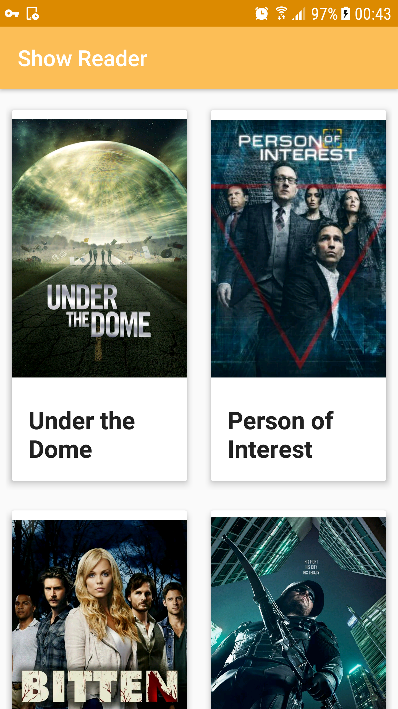
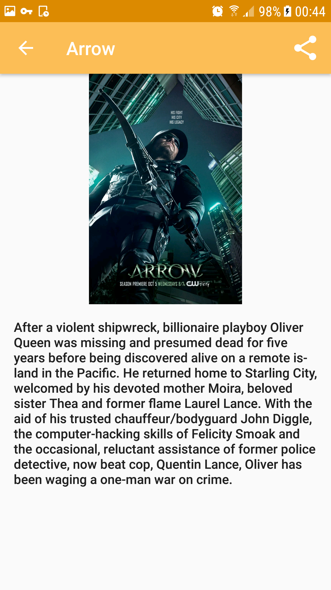

## Material tv show reader

This project is inspired by the [android-ribot-boilerplate](https://github.com/ribot/android-boilerplate)'s architecture

### API

Data are fetched from [TVmaze's API](http://api.tvmaze.com)

### Tests

To run **unit** tests on your machine:

```
./gradlew test
```

To run **functional** tests on connected devices:

```
./gradlew connectedAndroidTest
```

### Screenshots



